# Credit Default Prediction 

## Overview :

The reason to choose this dataset,  I am part of credit risk organization in PayPal. And I mainly work on buy now pay later products we see a very common issue of loan defaults before approving customer for next installments. Here it is a bank usecase.

Banks generate significant revenue through loan lending, but this comes with inherent risks, as borrowers may default on their loans. To address this, banks are leveraging Machine Learning (ML) to predict the likelihood of loan defaults. The goal is to analyze the historical data on borrowers, experiment with different machine learning models, and determine which model performs the best in predicting whether a new borrower is likely default.

The dataset is large and contains various factors such a borrower income, gender, loan purpose, etc. However, the data is also subject to challenges such as multicollinearity and missing values. This dataset is from Kaggle

1. Understand the Dataset & cleanup (if required).
2. Build classification model to predict weather the loan borrower will default or not.
3. Fine-tune the hyperparameters & compare the evaluation metrics of various classification algorithms.

## Rationale:
1. The rationale behind using Machine Learning (ML) to predict loan defaults is to enhance the decision-making process for banks and financial institutions when extending loans. Banks face the inherent risk that borrowers may default on their loans, leading to financial losses. By leveraging ML models to predict the likelihood of loan defaults based on historical data, banks can:

2. Improve Risk Assessment: ML can identify patterns and relationships in the data that are difficult for traditional methods to detect, improving the accuracy of risk assessments.

3. Early Warning System: It allows banks to identify high-risk borrowers early in the loan application process, potentially preventing defaults or enabling more informed decision-making regarding interest rates, loan terms, or even denial of loan applications.

4. Optimize Loan Portfolio: ML models can help banks diversify their loan portfolios by identifying which borrower profiles are more likely to default and adjusting their lending strategies accordingly.

5. Data-Driven Decisions: ML provides a data-driven approach to decision-making, minimizing biases and human error, ensuring a fairer and more consistent lending process.

## Business Impact:
The business impact of implementing ML for loan default prediction can be significant for banks and financial institutions in several areas:

1. Reduction in Loan Defaults: By accurately predicting the likelihood of default, banks can reduce the number of risky loans they approve, resulting in a decrease in defaults and associated financial losses.

2. Better Customer Segmentation: ML models allow banks to categorize borrowers based on risk profiles, enabling more personalized loan offers, tailored interest rates, and loan terms. Customers with a lower risk profile can receive favorable terms, while higher-risk borrowers may face higher interest rates or different conditions, mitigating risk for the bank.

3. Improved Profitability: By accurately assessing and managing risk, banks can optimize their lending portfolio, which can improve overall profitability. Reducing defaults directly translates to better financial outcomes and lower provision for bad loans.

4. Operational Efficiency: Implementing automated ML-based systems allows for faster loan processing and approval workflows, reducing manual intervention, errors, and the time spent on loan assessments. This can lead to cost savings and faster turnaround times for loan approvals.

5. Compliance and Regulatory Benefits: Financial institutions are subject to stringent regulations regarding lending practices. ML models that help ensure more accurate risk assessments can assist banks in adhering to regulatory standards, reducing the likelihood of compliance-related penalties or fines.

6. Long-Term Sustainability: By identifying high-risk borrowers and reducing defaults, banks improve their long-term sustainability. This helps to maintain financial stability and reduces the likelihood of experiencing large-scale losses that could jeopardize the institution's viability.

## Dataset 
 
 The data is related to the loan's terms and conditions, borrower’s profile, financial history, and loan details.
 
#### 1. Loan Terms and Conditions : These variables are directly related to the details and conditions of the loan:

   * loan_limit: The maximum amount of loan that can be granted to the borrower.
   * loan_type: The specific category of loan (e.g., mortgage, personal loan, auto loan).
   * loan_purpose: The reason for which the loan is being taken (e.g., home purchase, debt consolidation).
   * loan_amount: The actual amount of money that is being borrowed.
   * rate_of_interest: The interest rate charged on the loan amount.
   * Interest_rate_spread: The difference between the rate at which the bank lends and a benchmark interest rate.
   * Upfront_charges: Fees that are due at the time the loan is granted (e.g., processing fees, origination fees).
   * term: The length of time over which the loan must be repaid.
   * Neg_ammortization: Refers to a loan where the monthly payments do not cover all interest, leading to the loan balance increasing.
   * interest_only: A loan type where the borrower only pays interest for a certain period, typically with no principal repayment.
   * lump_sum_payment: A one-time payment made by the borrower during the term, often to pay off a portion of the loan.
   * LTV (Loan-to-Value): The ratio of the loan amount to the appraised value of the property being financed, used to assess risk.
   
####2. Borrower’s Profile: These variables describe the personal and financial characteristics of the loan applicant and any co-applicants.

   * Gender: The gender of the borrower.
   * Credit_Worthiness: The borrower’s ability and likelihood to repay the loan, often determined by a credit score or history.
   * income: The borrower’s income level, used to assess repayment capacity.
   * age: The borrower’s age, potentially affecting their eligibility or terms.
   * credit_type: The type of credit history the borrower has, for example, whether it’s from credit cards, mortgages, etc.
   * Credit_Score: A numerical score representing the borrower’s creditworthiness based on their financial history.
   * co-applicant_credit_type: The credit type of the co-applicant, if applicable.
   * submission_of_application: The date or status indicating when the loan application was submitted.
   
####3. Property and Security Information: These variables pertain to the property being financed and the collateral or security involved.
   * property_value: The appraised value of the property that serves as collateral for the loan.
   * construction_type: The construction method of the property, such as brick, wood, etc.
   * occupancy_type: Refers to the use of the property, e.g., owner-occupied, rental property, or second home.
   * Secured_by: The asset or collateral securing the loan (e.g., real estate, equipment).
   * total_units: The number of units in the property.
   * Security_Type: Type of security for the loan, for example, real estate, personal guarantee, etc.

####4. Approval and Status: These variables are related to the loan’s approval status and outcome. 
   * approv_in_adv: Indicates whether the loan has been approved in advance.
   * Status: The loan status (e.g., default or non-default).
   * dtir1: Likely a financial ratio or metric related to debt-to-income or other financial indicators, potentially measuring the borrower’s capacity to repay the loan.
   
####5. Business/Commercial and Region : This variable is related to loans that may involve business or commercial purposes and geographical location related to the loan:
   * business_or_commercial: Indicates whether the loan is for a business or commercial purpose.
   * Region: The geographic region where the loan is granted or the property is located.   
   
### Files 

* final_capstone.ipynb: The Jupyter Notebook containing the complete analysis, data preparation, modeling, and evaluation process.
* Loan_Default.csv: The dataset used for training and testing the machine learning models.

### Data Understanding :

* Load the dataset
* Check data type of the columns and dimensions of the dataframe
* Check the null values and duplicate rows
* Remove duplicate rows
* Dataset contains categorical data
* The target variable 'Status' indicates whether a customer credit loan is default ('1') or non-default ('0'). It is a binary classification variable with two possible outcomes: '1' and '0'.
* By categorizing these variables, we understand the key aspects of the loan terms, the borrower's profile, property details, and loan approval outcomes. 
* Breakdown of the categories:
     * Loan Terms and Conditions: loan_limit, loan_type, loan_purpose, loan_amount, rate_of_interest, Interest_rate_spread, Upfront_charges, term, Neg_ammortization, interest_only, lump_sum_payment, LTV.
    * Borrower’s Profile: Gender, Credit_Worthiness, income, credit_type, Credit_Score, co-applicant_credit_type, age, submission_of_application.
    * Property and Security Information: property_value, construction_type, occupancy_type, Secured_by, total_units, Security_Type.
    * Approval and Status: approv_in_adv, Status, dtir1.
    * Business/Commercial: business_or_commercial.
    * Region: Region.
    * Each of these variables provides insight into either the loan’s structure, the borrower’s characteristics, or the collateral/security backing the loan, helping the bank assess risk and decide on credit loan approval.
 * The dataset contains 148,670 rows, each representing an individual loan application. It has 34 columns(float64(8),object (21), int64(5)) encompassing various features of customer loan details. This large dataset is suitable for training machine learning models to predict loan default or non-default outcomes.
 * The 'Status' column has a distribution where 74.8% of the entries are categorized as '0', while 25.2% are categorized as '1'. This indicates a class imbalance, with the majority of data points falling into the '0' category.
 
### Data Preparation :

* The Status is target variable in the dataset indicates whether a loan has defaulted or not. It is a binary classification variable where:
     * 0 represents non-default (the loan is being repaid as agreed or is up to date).
     * 1 represents default (the loan has failed, typically due to missed payments, foreclosure, or write-off).
* All categorical columns were target encoded to transform data into numerical format for machine learning model
* Calculated IQR for numeric data and remove outliers
* The encoded features enhance the model’s ability to capture the impact of these attributes on campaign prediction.
* drop the columns which have too many null values - "rate_of_interest", "Interest_rate_spread", "Upfront_charges", "property_value", "LTV", "dtir1
* Remove 'ID' and 'Year' which doesn't have significance. 
* Drop rows with missing values from the dataframe.

* Univariate Analysis
    
   ** Plots :
    
    * 1. gender : 
  
   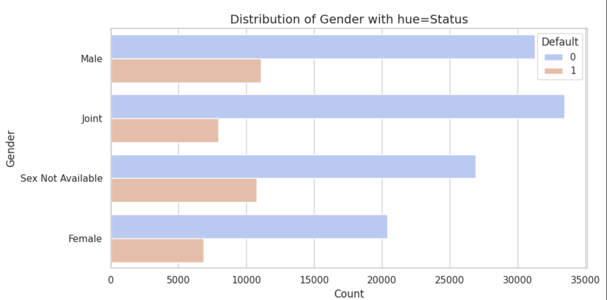
   
   * Analysis : The bar chart shows the distribution of loan status (default or non-default) across different gender categories. For non-default loans (Status = 0), Joint borrowers represent the largest group, followed by Male, Sex Not Available, and Female. In terms of defaults (Status = 1), Male borrowers have the highest number, closely followed by Sex Not Available, while Joint and Female borrowers have relatively lower default counts. This suggests that while Joint borrowers tend to have more non-default loans, Male borrowers exhibit a higher likelihood of defaulting compared to other gender categories. Overall, Joint borrowers have the most non-default loans, but Male borrowers seem to have a higher default risk.
    
    
     * 2. creditWorthiness
   
   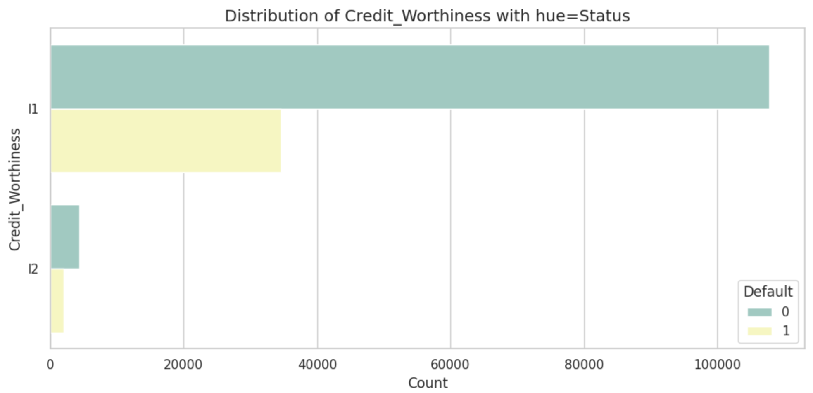
   
   * Analysis : The bar chart reveals that l1 (Credit_Worthiness) has a significantly higher number of loans for both non-default (Status = 0) and default (Status = 1) compared to l2. For non-default loans, l1 has over 1 million loans, while l2 only has 6,000. Similarly, for defaults, l1 shows 35,000 loans, while l2 has only 2,000. This suggests that l1 represents a much larger proportion of the dataset and is likely a more common credit worthiness classification. However, both l1 and l2 show a noticeable default rate, with l1 showing a higher volume of defaults as well.
   
       * 3. Approv_in_advance
   
   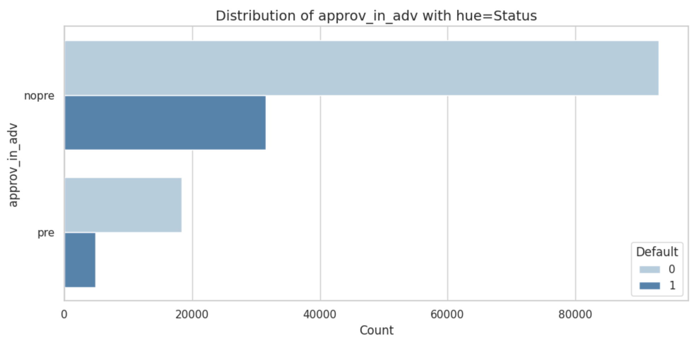
   
   * Analysis : The bar chart shows that preapproved loans (pre) do not significantly reduce default rates. While non-preapproved loans have a much higher count for both non-default and default statuses, preapproved loans still exhibit notable default numbers. This suggests that preapproval does not provide a clear benefit in reducing loan defaults.
   
      * 4. term
    
   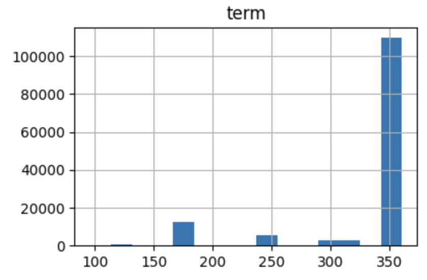
   
   * Analysis : The graph shows that most loans are concentrated in longer terms, with the highest number (120,000) at 360 months. Loans decrease as the term shortens, with around 3,000 at 250 months and 1,000 at 300 months. Between 150 and 200 months, there are 11,000 loans. This indicates a strong preference for longer-term loans, likely due to lower monthly payments.
    
    
* Bivariate Analysis 

  **Plots:  
        
   * 1. Income:loan_amount : The scatter plot for Income vs Loan Amount, color-coded by Status, reveals that the data points for Status values 0 and 1 are completely overlapping. This suggests that there is no clear separation between these two groups based on the Income and Loan Amount variables
   Implication: The overlap may indicate that Income and Loan Amount alone do not provide sufficient discrimination between the two Status categories (0 and 1). Further analysis or additional features may be necessary to better distinguish between these groups.
            *Income  vs. Loan_Amount: 
     
   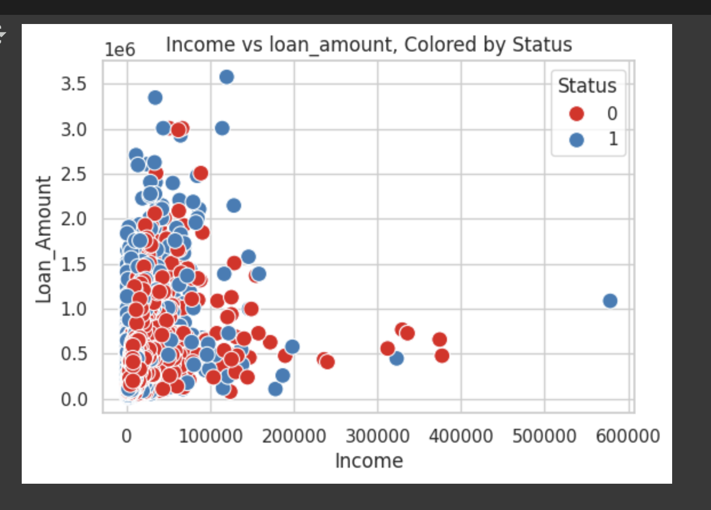
  
     
   * 2. Credit_Score:loan_amount :The hexbin plot shows that the majority of borrowers fall within a narrower range of Credit_Score (likely around the mid-to-lower range, closer to 500) and more moderate Loan Amounts. The distribution suggests that there are fewer borrowers at the extremes (both low credit scores with high loan amounts and high credit scores with low loan amounts). This could highlight specific lending patterns, with most borrowers having average or moderate credit scores and loan amounts.
    * Range of Variables:
        * Credit_Score values range from 500 to 900.
        * Loan Amount values range from 16,500 to 3,578,000.
            * Credit_Score vs. Loan_Amount: 
    
   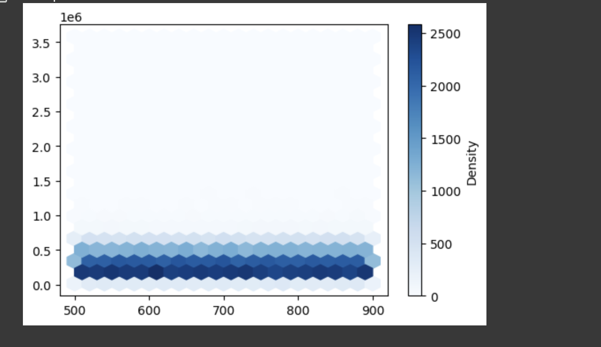 
  
     
*  The heatmap visually represents the correlation between the selected variables with values ranging from -1 to 1, where darker colors indicate stronger correlations and lighter colors represent weaker correlations.   
            * Correlations
    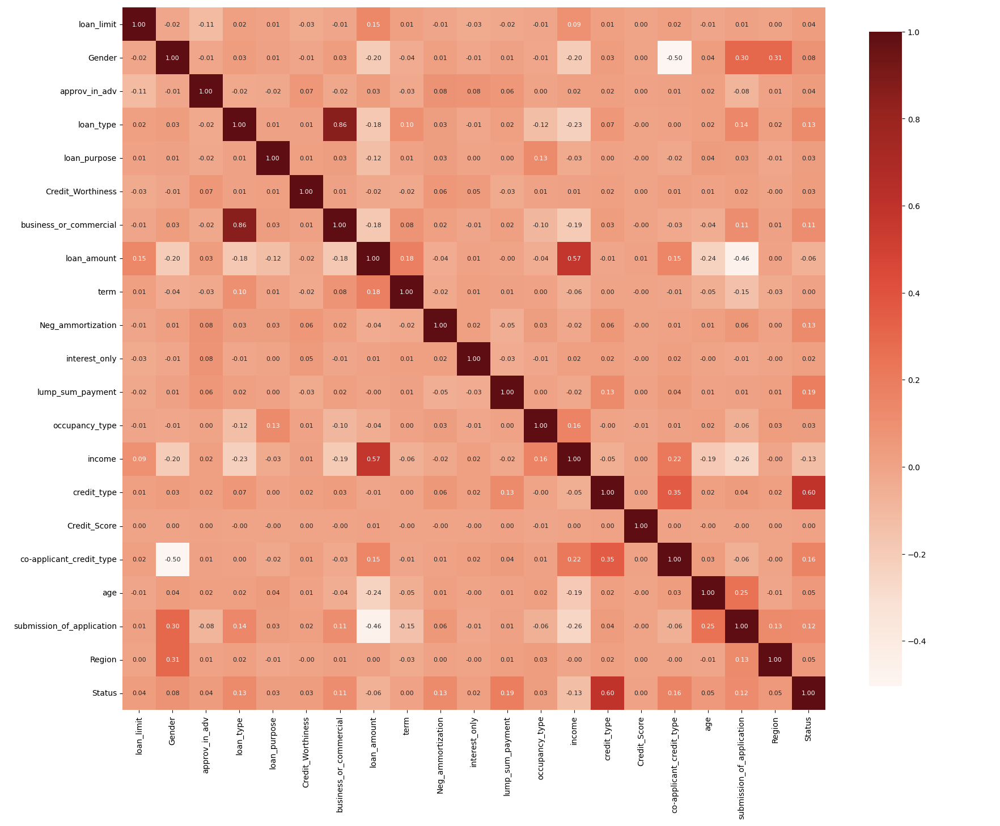
    
    
## Modeling :
### Baseline model
#### DummyClassifier :
* Baseline accuracy: 0.884724358455436
* Predictions: [0 0 0 0 0 0 0 0 0 0]
* Recall for class 0: 1.0
* Recall for class 1: 0.0

##### Analysis: The dummy classifier achieves a baseline accuracy of 88.47%, which is the proportion of the majority class in the dataset. It predicts only class '0' for all instances, resulting in a perfect recall of 1.0 for class '0' but a recall of 0.0 for class '1', showing that it fails to identify any instances of the minority class. This highlights the limitations of using a dummy classifier, as it does not learn patterns and simply predicts the majority class.

#### SVC:
* Predictions: [0 0 0 ... 0 0 0]
* Accuracy: 0.749
* Recall for class 0: 1.000
* Recall for class 1: 0.000

##### Analysis : The SVC model shows an accuracy of 74.9%, primarily predicting class '0' (which makes up 74.8% of the data). The recall for class '0' is perfect at 1.000, but the recall for class '1' is 0.000, indicating that the model fails to correctly identify any instances of class '1'. This suggests a significant class imbalance or an overfitting to class '0', where the model is biased toward predicting the majority class.

### Simple model without params definition
                   
##### Logistic regression 
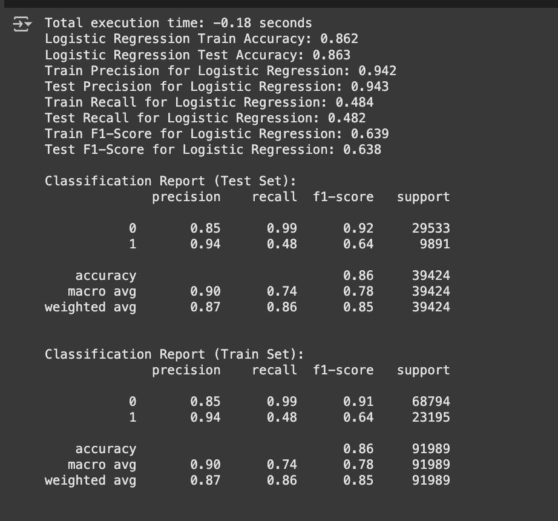 

##### Other Models

#### Model Performance
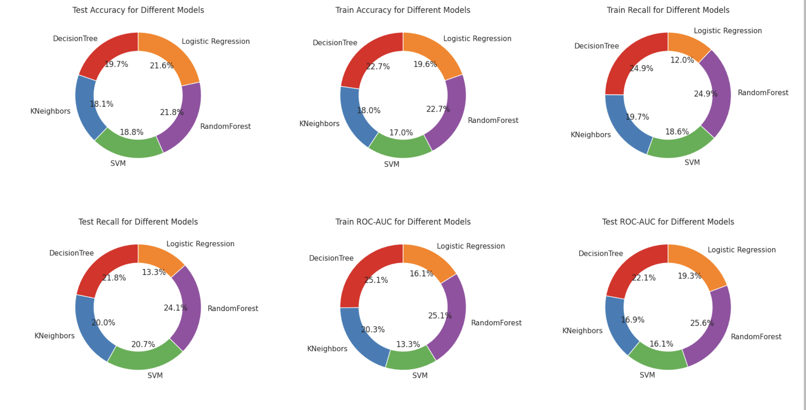

##### Analysis : 
 * Details
 
   1. RandomForest:
     Best test accuracy (0.870) and test recall (0.870).Strong test ROC-AUC (0.844), indicating solid generalization to unseen data.Exhibits perfect train accuracy (1.000) and train recall (1.000), which may indicate slight overfitting but still performs well on the test set.
   2. Logistic Regression: Test accuracy is 0.863, which is decent but lower than RandomForest.Test recall and train recall (0.484 and 0.639, respectively) are comparatively low, suggesting it might not be identifying positive cases effectively.Moderate train ROC-AUC (0.639), indicating room for improvement, especially in model regularization or class balancing.
   3. DecisionTree:Perfect train accuracy (1.000) and train recall (1.000), but relatively lower test accuracy (0.787) and test recall (0.787).This suggests overfitting—it fits the training data perfectly but struggles to generalize to the test set.
   4. KNeighbors:Lower test accuracy (0.723) and test ROC-AUC (0.558), suggesting suboptimal performance with default settings.Train recall (0.791) is reasonable, but it struggles to maintain performance on the test set.
   5. SVM:Very low train ROC-AUC (0.530) and test ROC-AUC (0.531), indicating poor separation of classes in both training and test data.Test accuracy (0.749) is relatively moderate, but it doesn’t perform as well as the other models in terms of distinguishing between classes.
    
   * Recommendations: RandomForest is the strongest performer overall. Logistic Regression, KNeighbors, and SVM could benefit from tuning hyperparameters for better performance.DecisionTree may need pruning or cross-validation to reduce overfitting.
    
#### Models with params
   Additional hyperparameter tuning and exploring models.
     Note: SVM is not considered, as it was taking more than couple of hours to run the model  
   
   Results :
     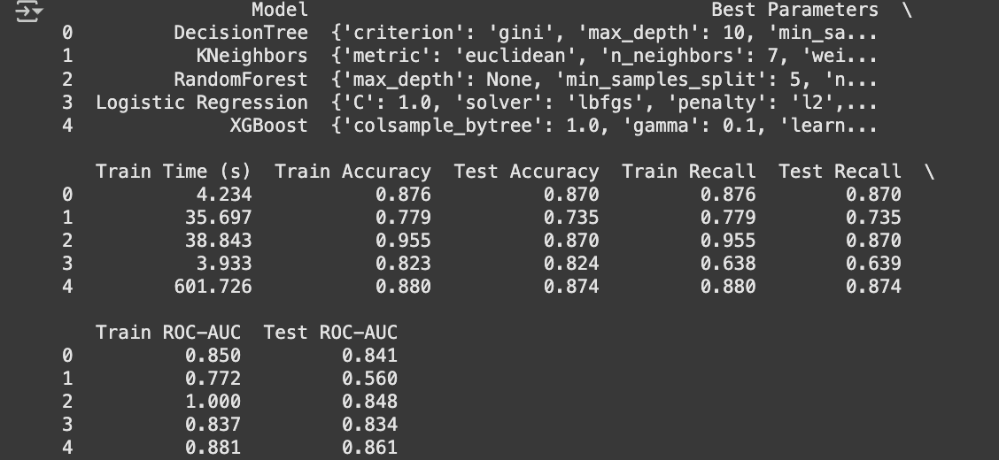
    
    #### Model Performance
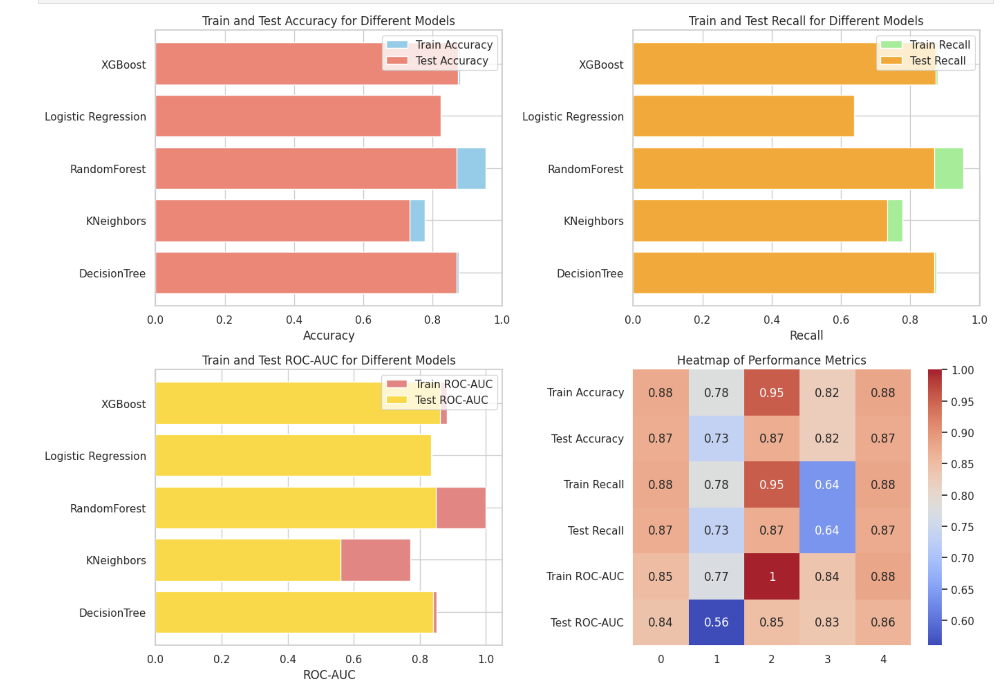

## Conclusion : 
   
   * Details 
   
       1. Random Forest performed the best with a Train ROC-AUC of 1.0 and Test ROC-AUC of 0.848. The hyperparameter tuning used for Random Forest included max_depth=None, min_samples_split=5, and n_estimators=100, which contributed to its strong performance on both the training and test sets.
     
      2. XGBoost also showed strong performance with a Test ROC-AUC of 0.861, but required significant training time (601.7 seconds). The hyperparameters optimized were learning_rate=0.1, max_depth=5, n_estimators=200, subsample=0.8, and colsample_bytree=1.0, which helped improve its test performance.
    
      3. Logistic Regression had a lower Train Recall (0.638), and its hyperparameters (C=1.0, solver='lbfgs', penalty='l2', class_weight='balanced') were optimized, but the model struggled with correctly identifying positive cases during training.
      4. KNeighbors cperformed the worst with Test ROC-AUC of 0.560. Its hyperparameters (n_neighbors=7, weights='uniform', metric='euclidean') did not lead to competitive performance compared to other models.
 
   Overall, Random Forest balances high performance across all metrics, including accuracy, recall, and ROC-AUC, making it the most well-rounded model.
   
## Next Steps and Recommendations :

1. Deploy Best Performing Model: Deploy Random Forest or XGBoost for real-time loan approval systems based on their strong performance on test data.

2. Model Monitoring: Set up a continuous monitoring system to track model performance and detect concept drift or data shifts over time.

3. Retraining Strategy: Establish a retraining pipeline to automatically retrain the model with new data, especially as loan trends change.

4. Improve Feature Engineering: Integrate alternative data sources like transaction history or utility payments to capture a broader picture of borrowers.

5. Address Imbalanced Classes: Fine-tune models to handle class imbalance better, possibly using techniques like SMOTE or undersampling.

6. Hyperparameter Tuning: Conduct further hyperparameter optimization for the XGBoost and Random Forest models to squeeze out additional performance.

7. Customer-Centric Strategy: Develop personalized loan offers based on the model’s predictions, using risk-based pricing.

8. Business Impact Measurement: Regularly measure the business impact of the model, particularly in terms of reduced defaults and improved profitability.

    
    
       
     

 
   

